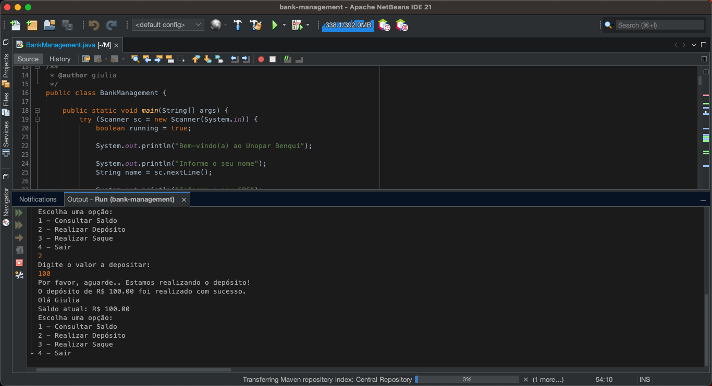

# Bank Management

Este projeto consiste na criação de uma aplicação Java para gerenciamento bancário, implementada em um único arquivo
Java
(main class), como proposto no enunciado da disciplina de Linguagem Orientada a Objetos.

## Enunciado do Relatório

Utilizando os principais conceitos do paradigma de Orientação a Objetos, crie uma pequena aplicação de gerenciamento
bancário que possibilite ao usuário informar seu nome, sobrenome e CPF.

Além disso, a aplicação deverá possibilitar ao
usuário consultar saldo, realizar depósitos e saques. Esses procedimentos devem se repetir até que o usuário escolha
encerrar o uso da aplicação.

- Construa a aplicação em um único arquivo java
- No arquivo criado, você deverá construir:
    - A classe principal
    - Classe para dados pessoais e operações bancárias
    - Método para exibição do menu
- Exibição de um menu com opções para consulta de saldo, depósito, retirada e encerramento da aplicação.
- Utilização de estruturas de decisão (switch… case, do… while) para tratar as escolhas do usuário.
- Encerramento da execução da aplicação com uma mensagem de despedida.

### Checklist

- [x] Instalação do NetBeans.
- [x] Ambiente de desenvolvimento NetBeans e JDK devidamente configurado e funcionando.
- [x] Criação de um projeto Java Application em Java com Maven.
- [x] Implementação do código em Java utilizando conceitos da programação orientada a objetos.

## Projeto

### Estrutura do Projeto

O projeto Java Application contém os seguintes arquivos:

- [BankManagement](./src/main/java/br/giulia/bank/management/BankManagement.java): classe principal que contém a main e
  a lógica da aplicação.
- [BankManagementTest](./src/test/java/br/giulia/bank/management/BankManagementTest.java): classe principal dos testes
  unitários
- [README.md](README.md): documentação do projeto.

### Tecnologias utilizadas

- Java 21
- Apache NetBeans IDE
- JUnit 5
- GitHub Actions

### Como usar

Para usar o projeto de gerenciamento bancário implementado em Java descrito no README, siga as instruções abaixo para
configurar e executar a aplicação:

#### Pré-requisitos

- Java Development Kit 21
- Maven
- IDE Java, como o NetBeans, Eclipse ou IntelliJ IDEA, instalada em seu sistema para facilitar o desenvolvimento e
  execução do código.
- Clonar este repositório

#### Execução

- **Forma 1**
  - Abra o projeto na IDE de sua preferência
  - Localize o arquivo `BankManagement.java` e abra-o
  - Clique em "Run" na barra de ferramentas ou menu de contexto da sua IDE
  - Quando a aplicação iniciar, siga as instruções no console, como: insira seu nome, cpf, etc.
- **Forma 2**
  - Em um terminal aberto na pasta clonada do projeto
  - Execute o comando `mvn clean install`
  - Quando realizar o install com sucesso, aparecerá algo como "BUILD SUCCESS"
  - Para executar a aplicação, execute o comando `java -jar target/java-bank-management-1.0-SNAPSHOT.jar`
  - Siga as instruções no console

Ao seguir esses passos, você conseguirá configurar, compilar e executar a aplicação de gerenciamento bancário em Java
conforme descrito no README.

## Referências

- [BigDecimal compareTo() Function in Java](https://www.geeksforgeeks.org/bigdecimal-compareto-function-in-java/)
- [How to capture and store console output, System.out.println()](https://openwritings.net/pg/java/how-capture-and-store-console-output-systemoutprintln)
- [Assert an Exception Is Thrown in JUnit 4 and 5](https://www.baeldung.com/junit-assert-exception)
- [How to Create an Executable JAR with Maven](https://www.baeldung.com/executable-jar-with-maven)